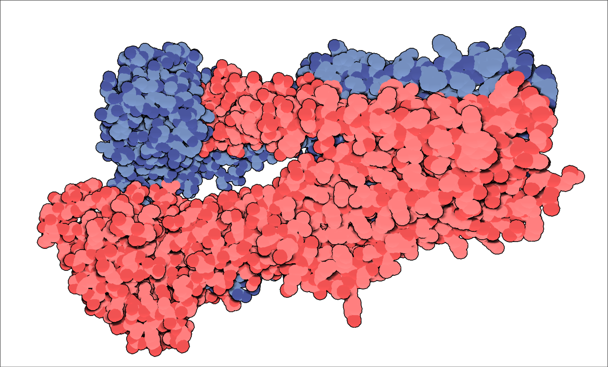

# Lollipop

A simple, stylised 3D graphics engine for the visualisation of protein structures from the Protein Data Bank (pdb). Written from scratch in Lua and GLSL using the excellent LOVE2D framework.

Includes a cartoonish "spheres" representation by default, with depth based protein outlines, a full Phong shading model and real-time SSAO (as well as a heavily configurable config file)!

## Instructions

- Rotation of molecules through the wasd/qe keys
- Translation of molecules with the ijkl/uo keys
